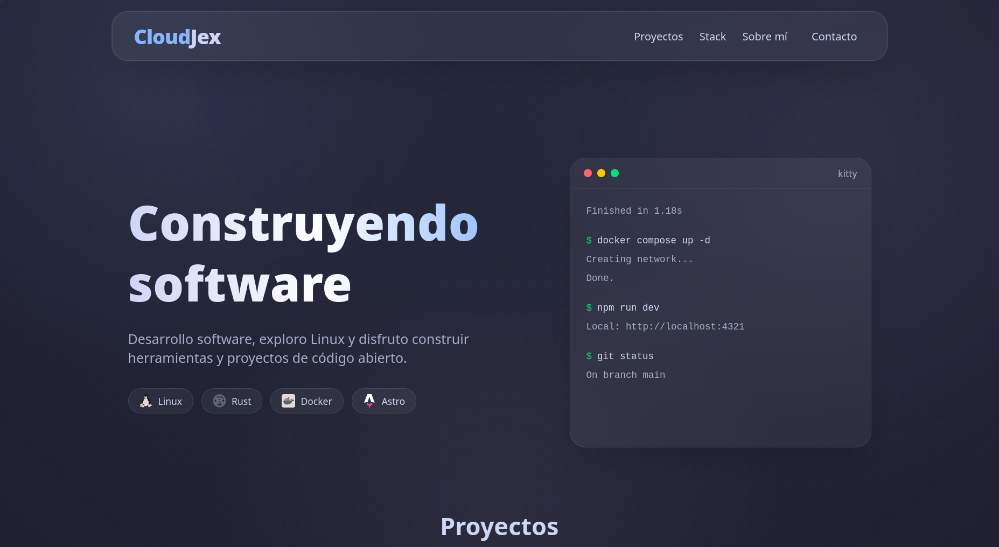

# CloudJex

Mi portafolio personal desarrollado con **Astro** y **Tailwind CSS**, donde comparto los proyectos, tecnologías y herramientas con las que trabajo.

## Vista previa

<p align="center">
  
</p>

## Características

- Diseño responsive.
- Tema inspirado en Catppuccin.
- Interfaz con efecto Glassmorphism.
- Navegación suave entre secciones.
- Animación de una terminal interactiva.
- Interfaz moderna y minimalista.

## Tecnologías

- Astro
- Tailwind CSS
- TypeScript

## Instalación

```bash
git clone https://github.com/Cloudjexp/Portafolio.git

cd Portafolio

npm install

npm run dev
```

## Licencia

Este proyecto está disponible bajo la licencia MIT.